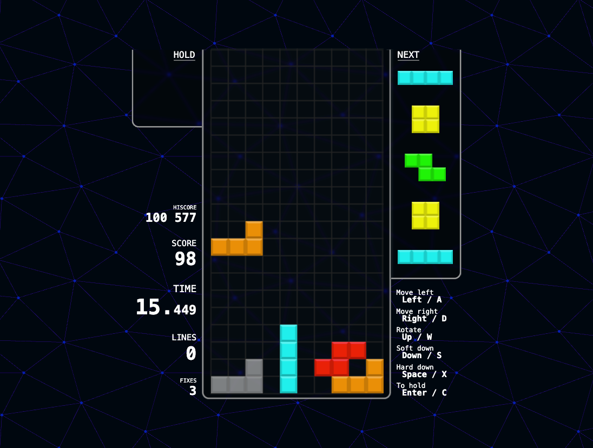
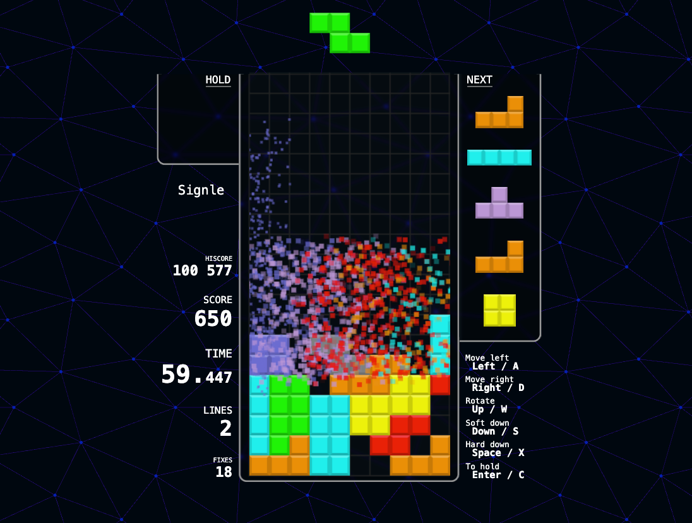
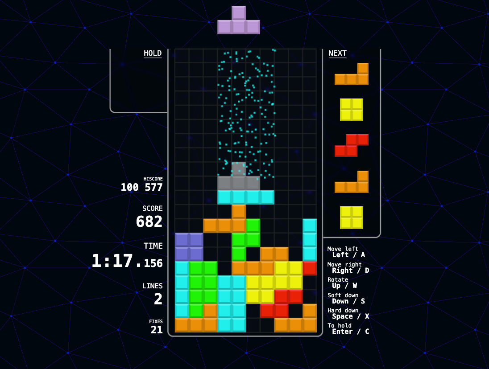

# New Tetris

**New Tetris** is a modern implementation of the classic Tetris game, built using react and the Canvas 2D API. The project focuses on clean code, performance, and a minimalist interface.

---

## 📸 Screenshots


*Gameplay with active pieces and next queue.*


*Particle effects on line clear.*


*Particle effects on dash piece.*

---

## 🚀 Installation and Running

### 1. Clone the repository

```bash
git clone https://github.com/vicimpa/new-tetris.git
cd new-tetris
```

### 2. Install dependencies

```bash
bun install
# or
npm install
```

### 3. Run in development mode

```bash
bun dev
# or
npm run dev
```

### 4. Open the game

Open your browser and go to [http://localhost:3000](http://localhost:3000).

---

## 🧩 Project Structure

* `src/`: Application source code

  * `core/`: Game logic (mechanics, state management)
  * `ui/`: User interface components (game field, stats, settings)
  * `hooks/`: Custom hooks for state and effects
  * `utils/`: Utilities and helper functions
* `public/`: Static assets (icons, fonts, etc.)
* `index.html`: Entry point of the application

---

## 🎮 Key Features

* **Game mechanics**: Classic Tetris with hold, combos, and line clearing.
* **Interface**: Minimalist and responsive design using Canvas 2D API.
* **Animations**: Particle effects for line clears and other actions.
* **Game state**: Fully reactive implementation using custom hooks and signals.
* **Sounds**: Audio effects for movements, rotations, drops, combos, pause, and game over.

---

## 📦 Technologies

* **Preact**: Lightweight alternative to React for building user interfaces.
* **Canvas 2D API**: Used for rendering the game field and animations.
* **TypeScript**: Static typing for increased reliability.
* **Bun**: Modern runtime and build tool.
* **Vite**: Fast development server with hot module replacement.

---

## 📄 License

This project is licensed under the MIT License — see the [LICENSE](LICENSE) file for details.
